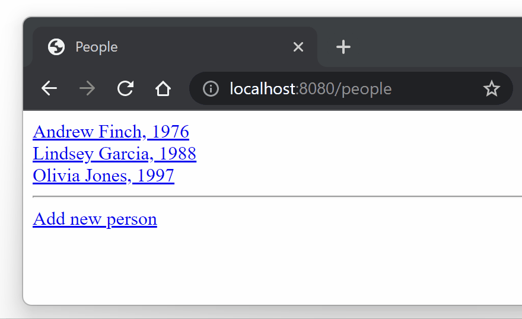

## Web-application for librarians to book management tasks

The system empowers librarians to perform various tasks, including creating, editing, and deleting book records, registering new customers, modifying customer information, and removing customer profiles. Additionally, librarians can lend books to customers and track the return of books.

### How does it work?

---

I created three distinct versions of the app with similar functionality, each utilizing a different library as follows:

- [Spring MVC + JDBC](https://github.com/Kidchai/LibraryManagementSystem/tree/Spring_MVC+JDBC)
- [Spring MVC + Hibernate](https://github.com/Kidchai/LibraryManagementSystem/tree/Spring_MVC+Hibernate)
- [Spring MVC + Hibernate + Spring Data JPA](https://github.com/Kidchai/LibraryManagementSystem/tree/Spring_MVC+Hibernate+Spring_Data_JPA)

other technologies: Java, PostgreSQL, Thymeleaf, HTML