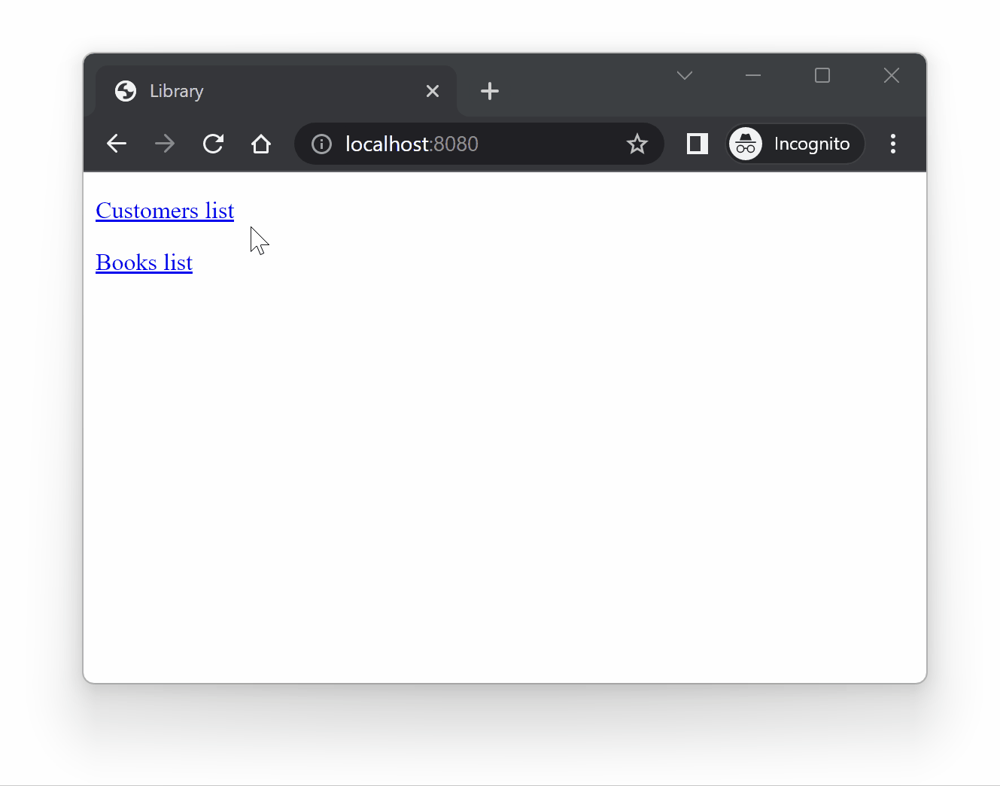

# Web-application for librarians to book management tasks

## What is it?
This is a web-application designed to simplify the book management tasks of librarians. It provides an easy-to-use interface for managing book records and customer profiles.

## What does this version do?
Built with Spring MVC, Hibernate, and Spring Data JPA, this version of application utilizes PostgreSQL to store book and customer records, and Thymeleaf as a template engine for a user interface.

This system streamlines a variety of librarian tasks, including creating, editing, and deleting book records, registering new customers, modifying customer information, and removing customer profiles. Additionally, librarians can lend books to customers and track the return of books.

## What's new in this version?

This version includes some new features that I believe will make managing libraries more efficient, such as:

- The ability to search for books by title.
- The option to sort books by year of publication.
- Automatic tracking of borrowed books, with a 30-day return policy.
- Overdue books are highlighted in red in the customer's lists.

## Look! It's running!



## How to run?

**Requirements**

- Docker

If you don't have Docker, you can download it [here](https://www.docker.com/products/docker-desktop).

<details>
  <summary>In case you don't want to use Docker, check out instructions under this spoiler.
</summary>

**Requirements**

- JDK 17 or newer
- Maven
- PostgreSQL
- Git

### Steps

**1. Clone the repository and navigate to the project directory**

```bash
$ git clone https://github.com/Kidchai/library-management-system.git
$ cd library-management-system
```

**2. Create a database in PostgreSQL**

```sql
CREATE DATABASE your_database_name;
```

**3. Set up the connection to the PostgreSQL database in the *application.properties* file.**

Navigate to the *application.properties* file located in the *src/main/resources* directory and update the following properties:

```properties
spring.datasource.url=jdbc:postgresql://localhost:5432/library-db
spring.datasource.username=postgres
spring.datasource.password=postgres
```

Replace *library-db*, *postgres*, and *postgres* with the database name, username, and password.

**4. Install dependencies and build the project**

```bash
$ mvn clean install
```

**5. Run the application**

```bash
$ mvn spring-boot:run
```

Now you need just open your web browser and navigate to http://localhost:8080

If you want to run unit tests, run the:

```bash
$ mvn test
```
</details>

**1. Clone the repository and navigate to the project directory**

```bash
$ git clone https://github.com/Kidchai/library-management-system.git
$ cd library-management-system
```

**2. Start the application and database using Docker**

```bash
$ docker-compose up
```

Now you need just open your web browser and navigate to http://localhost:8080

## What about other versions?

If you're interested in seeing how my application has evolved over time, you can check out the other branches, which include:

- [Spring MVC + JDBC](https://github.com/Kidchai/LibraryManagementSystem/tree/Spring_MVC+JDBC)
- [Spring MVC + Hibernate](https://github.com/Kidchai/LibraryManagementSystem/tree/Spring_MVC+Hibernate)
- [Spring MVC + Hibernate + Spring Data JPA](https://github.com/Kidchai/LibraryManagementSystem/tree/Spring_MVC+Hibernate+Spring_Data_Jpa)